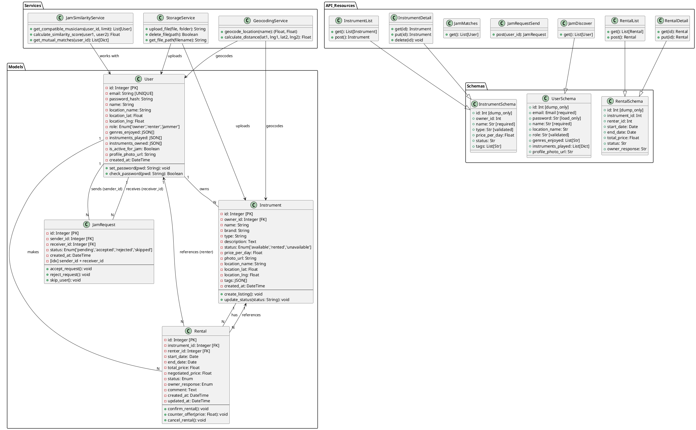

# Souk'Jam Class Diagram - Development Guide

A comprehensive guide containing all classes, attributes, relationships, and methods in the Souk'Jam project.

---

## 📋 Table of Contents

1. [Core Domain Models](#core-domain-models)
2. [Entity Relationships](#entity-relationships)
3. [Enum Types](#enum-types)
4. [Schema/Serialization Classes](#schemaserialization-classes)
5. [Service Classes](#service-classes)
6. [API Resource Classes](#api-resource-classes)
7. [Complete UML Diagram](#complete-uml-diagram)

---

## 🏗️ Core Domain Models

### 1. User Class

**Location:** `/app/models/user.py`

**Purpose:** Represents a user account with authentication, location tracking, and musical preferences.

**Attributes:**

| Attribute | Type | Constraints | Description |
|-----------|------|-----------|------------|
| `id` | Integer | PK | Primary key - unique identifier |
| `email` | String(120) | UNIQUE, NOT NULL | User's email address (login credential) |
| `password_hash` | String(128) | NOT NULL | Bcrypt-hashed password |
| `name` | String(100) | NOT NULL | User's display name |
| `location_name` | String(255) | NULLABLE | Location description (e.g., "Tunis, Tunisia") |
| `location_lat` | Float | NULLABLE | Latitude (geocoded from location_name) |
| `location_lng` | Float | NULLABLE | Longitude (geocoded from location_name) |
| `role` | Enum | NOT NULL, DEFAULT='jammer' | Role: 'owner', 'renter', 'jammer' |
| `genres_enjoyed` | JSON | DEFAULT=[] | List of music genres (rock, jazz, classical, oriental, etc.) |
| `instruments_played` | JSON | DEFAULT=[] | List of {instrument_type, skill_level} objects |
| `instruments_owned` | JSON | DEFAULT=[] | List of owned instrument types |
| `is_active_for_jam` | Boolean | DEFAULT=False | Flag for jam session participation |
| `profile_photo_url` | String(255) | NULLABLE | URL to user's profile photo |
| `created_at` | DateTime | DEFAULT=now() | Account creation timestamp |

**Methods:**

```python
def set_password(password: str) -> None
    """Hash and store password using werkzeug.security"""

def check_password(password: str) -> bool
    """Verify provided password against stored hash"""
```

**Relationships:**

- **owns** → `Instrument` (1:N)
  - One user can own many instruments
  - Backref: `owner`
  - Lazy loading: True

- **rents** → `Rental` (1:N)
  - One user can make multiple rental requests
  - Backref: `renter`
  - Lazy loading: True

- **sent_requests** → `JamRequest` (1:N)
  - One user can send multiple jam requests
  - Foreign key: `jam_request.sender_id`
  - Backref: `sender`

- **received_requests** → `JamRequest` (1:N)
  - One user can receive multiple jam requests
  - Foreign key: `jam_request.receiver_id`
  - Backref: `receiver`

---

### 2. Instrument Class

**Location:** `/app/models/instrument.py`

**Purpose:** Represents an instrument listing available for rental.

**Attributes:**

| Attribute | Type | Constraints | Description |
|-----------|------|-----------|------------|
| `id` | Integer | PK | Primary key - unique identifier |
| `owner_id` | Integer | FK→users.id, NOT NULL | Reference to the owner User |
| `name` | String(100) | NOT NULL | Instrument name (e.g., "Fender Stratocaster") |
| `brand` | String(50) | NULLABLE | Manufacturer name (e.g., "Fender", "Yamaha") |
| `type` | String(50) | NOT NULL | Instrument type (guitar, drums, piano, violin, oud, etc.) |
| `description` | Text | NULLABLE | Detailed description (condition, features, specs) |
| `status` | Enum | NOT NULL, DEFAULT='available' | Status: 'available', 'rented', 'unavailable' |
| `price_per_day` | Float | NOT NULL | Daily rental price in TND (Tunisian Dinar) |
| `photo_url` | String(255) | NULLABLE | URL to instrument photo |
| `location_name` | String(255) | NULLABLE | Location description (where instrument is available) |
| `location_lat` | Float | NULLABLE | Latitude for proximity search |
| `location_lng` | Float | NULLABLE | Longitude for proximity search |
| `tags` | JSON | NULLABLE | List of searchable tags/keywords |
| `created_at` | DateTime | DEFAULT=now() | Listing creation timestamp |

**Methods:**

```python
# Implicit methods via SQLAlchemy ORM
def create_listing() -> None
def update_status(new_status: str) -> None
def get_details() -> dict
```

**Relationships:**

- **owned_by** → `User` (N:1)
  - Many instruments belong to one owner
  - Foreign key: `owner_id`
  - Backref: `owner`

- **has_many** → `Rental` (1:N)
  - One instrument can be rented multiple times
  - Backref: `instrument`
  - Lazy loading: True

---

### 3. Rental Class

**Location:** `/app/models/rental.py`

**Purpose:** Represents a rental transaction between a renter and an instrument owner.

**Attributes:**

| Attribute | Type | Constraints | Description |
|-----------|------|-----------|------------|
| `id` | Integer | PK | Primary key - unique identifier |
| `instrument_id` | Integer | FK→instruments.id, NOT NULL | Reference to the rented Instrument |
| `renter_id` | Integer | FK→users.id, NOT NULL | Reference to the renting User |
| `start_date` | Date | NOT NULL | Rental period start date |
| `end_date` | Date | NOT NULL | Rental period end date |
| `total_price` | Float | NOT NULL | Calculated rental cost (days × price_per_day) |
| `negotiated_price` | Float | NULLABLE | Final agreed price after negotiation |
| `status` | Enum | NOT NULL, DEFAULT='pending' | Status: 'pending', 'confirmed', 'completed', 'cancelled' |
| `owner_response` | Enum | NOT NULL, DEFAULT='pending' | Owner response: 'pending', 'accepted', 'rejected', 'counter_offer' |
| `comment` | Text | NULLABLE | Renter's rental request comment |
| `created_at` | DateTime | DEFAULT=now() | Request creation timestamp |
| `updated_at` | DateTime | DEFAULT=now() | Last modification timestamp (auto-updated) |

**Methods:**

```python
# Implicit methods via SQLAlchemy ORM
def create_rental() -> None
def confirm_rental() -> None
def counter_offer(new_price: float) -> None
def cancel_rental() -> None
def complete_rental() -> None
```

**Relationships:**

- **rented_instrument** → `Instrument` (N:1)
  - Many rentals reference one instrument
  - Foreign key: `instrument_id`
  - Backref: `instrument`

- **requested_by** → `User` (N:1)
  - Many rentals belong to one renter
  - Foreign key: `renter_id`
  - Backref: `renter`

---

### 4. JamRequest Class

**Location:** `/app/models/jam.py`

**Purpose:** Represents a jam session connection request between two musicians.

**Attributes:**

| Attribute | Type | Constraints | Description |
|-----------|------|-----------|------------|
| `id` | Integer | PK | Primary key - unique identifier |
| `sender_id` | Integer | FK→users.id, NOT NULL | Reference to the sending User |
| `receiver_id` | Integer | FK→users.id, NOT NULL | Reference to the receiving User |
| `status` | Enum | NOT NULL, DEFAULT='pending' | Status: 'pending', 'accepted', 'rejected', 'skipped' |
| `created_at` | DateTime | DEFAULT=now() | Request creation timestamp |

**Indexes:**

- Composite index: `(sender_id, receiver_id)` for fast lookups

**Methods:**

```python
# Implicit methods via SQLAlchemy ORM
def send_request() -> None
def accept_request() -> None
def reject_request() -> None
def skip_user() -> None
```

**Relationships:**

- **sent_by** → `User` (N:1) [sender]
  - Many requests sent by one user
  - Foreign key: `sender_id`
  - Backref: `sent_requests`

- **received_by** → `User` (N:1) [receiver]
  - Many requests received by one user
  - Foreign key: `receiver_id`
  - Backref: `received_requests`

---

## 🔗 Entity Relationships

### Relationship Diagram

```
┌──────────────────┐
│      User        │
│   (musicians)    │
└────────┬─────────┘
         │
    ┌────┴────┬──────────────┬──────────────┐
    │          │              │              │
    ▼          ▼              ▼              ▼
 owns    rents/requests   sends/receives  participates
    │          │              │              │
    ▼          ▼              ▼              ▼
┌─────────┐ ┌────────┐  ┌──────────┐  ┌─────────┐
│Instrument│ │ Rental │  │JamRequest│  │ Profiles│
│(1:N)     │ │ (1:N)  │  │  (1:N)   │  │ & Prefs │
└─────────┘ └────────┘  └──────────┘  └─────────┘
     │
     │ rented_in
     ▼
  ┌────────┐
  │ Rental │
  └────────┘
```

### Detailed Relationships

| From | To | Type | Cardinality | Description |
|------|-----|------|-------------|------------|
| **User** | **Instrument** | owns | 1:N | One user owns many instruments for rental |
| **User** | **Rental** | rents | 1:N | One user makes multiple rental requests |
| **Instrument** | **Rental** | has | 1:N | One instrument can be rented multiple times |
| **User** | **JamRequest** | sends | 1:N | One user sends multiple jam requests (sender_id) |
| **User** | **JamRequest** | receives | 1:N | One user receives multiple jam requests (receiver_id) |

---

## 📊 Enum Types

### 1. User Role Enum (`user_role`)

```python
Enum Values:
  - 'owner'  → User owns instruments for rental
  - 'renter' → User rents instruments from others
  - 'jammer' → User participates in jam sessions (DEFAULT)
```

**Usage:** `User.role` column

---

### 2. Instrument Status Enum (`instrument_status`)

```python
Enum Values:
  - 'available'   → Instrument can be rented (DEFAULT)
  - 'rented'      → Instrument currently under rental
  - 'unavailable' → Instrument cannot be rented (maintenance, etc.)
```

**Usage:** `Instrument.status` column

---

### 3. Rental Status Enum (`rental_status`)

```python
Enum Values:
  - 'pending'     → Awaiting owner response (DEFAULT)
  - 'confirmed'   → Owner accepted; rental is active
  - 'completed'   → Rental period ended successfully
  - 'cancelled'   → Rental cancelled by either party
```

**Usage:** `Rental.status` column

---

### 4. Owner Response Enum (`owner_response_status`)

```python
Enum Values:
  - 'pending'       → Awaiting response (DEFAULT)
  - 'accepted'      → Owner accepted the rental
  - 'rejected'      → Owner rejected the rental
  - 'counter_offer' → Owner made a counter-price offer
```

**Usage:** `Rental.owner_response` column (dual-track approval)

---

### 5. Jam Status Enum (`jam_status`)

```python
Enum Values:
  - 'pending'  → Request sent, awaiting response (DEFAULT)
  - 'accepted' → Recipient accepted jam session
  - 'rejected' → Recipient rejected jam session
  - 'skipped'  → Sender skipped this user in discovery
```

**Usage:** `JamRequest.status` column

---

## 📦 Schema/Serialization Classes

### Location: `/app/schemas/`

These classes handle data validation and serialization for API requests/responses.

#### **UserSchema** (`user.py`)

```python
class UserSchema(Schema):
    Attributes:
    - id: Int (dump_only)
    - email: Email (required on input)
    - password: Str (required on input, load_only - never dumped)
    - name: Str (required, 1-100 chars)
    - location_name: Str
    - location_lat: Float (dump_only - computed server-side)
    - location_lng: Float (dump_only - computed server-side)
    - role: Str (one of: 'owner', 'renter', 'jammer'; default='jammer')
    - genres_enjoyed: List[Str] (validated against allowed genres)
    - instruments_played: List[Dict] (with instrument_type & skill_level)
    - instruments_owned: List[Str] (validated instrument types)
    - is_active_for_jam: Bool (default=False)
    - profile_photo_url: Str
    - created_at: DateTime (dump_only)
    
    Custom Validators:
    - validate_instruments_played() → ensures valid structure
```

**Allowed Values:**

- **Genres:** rock, metal, jazz, blues, classical, oriental, reggae, funk, pop, electronic, hiphop
- **Instruments:** guitar, bass, drums, piano, violin, oud, darbuka, zokra, doff, vocals

---

#### **InstrumentSchema** (`instrument.py`)

```python
class InstrumentSchema(Schema):
    Attributes:
    - id: Int (dump_only)
    - owner_id: Int
    - owner_name: Str (dump_only - from related User)
    - name: Str (required)
    - brand: Str
    - type: Str (required, validated)
    - description: Str
    - status: Str (one of: 'available', 'rented', 'unavailable')
    - price_per_day: Float (required)
    - photo_url: Str
    - location_name: Str
    - location_lat: Float
    - location_lng: Float
    - tags: List[Str]
    - created_at: DateTime (dump_only)
```

---

#### **RentalSchema** (`rental.py`)

```python
class RentalSchema(Schema):
    Attributes:
    - id: Int (dump_only)
    - instrument_id: Int (required)
    - renter_id: Int (required)
    - start_date: Date (required)
    - end_date: Date (required)
    - total_price: Float (computed)
    - negotiated_price: Float
    - status: Str (enum)
    - owner_response: Str (enum)
    - comment: Str
    - created_at: DateTime (dump_only)
    - updated_at: DateTime (dump_only)
    - renter_name: Str (dump_only - from related User)
    - instrument_name: Str (dump_only - from related Instrument)
    - owner_id: Int (dump_only - from instrument.owner_id)
```

---

#### **SearchInstrumentSchema** (`search.py`)

```python
class SearchInstrumentSchema(Schema):
    Query Parameters:
    - name: Str (OPTIONAL - search by name)
    - type: Str (OPTIONAL - filter by instrument type)
    - price_min: Float (OPTIONAL - minimum price per day)
    - price_max: Float (OPTIONAL - maximum price per day)
    - location_name: Str (OPTIONAL - filter by location)
    - latitude: Float (OPTIONAL - user lat for proximity)
    - longitude: Float (OPTIONAL - user lng for proximity)
    - distance_km: Float (OPTIONAL - search radius)
    - tags: List[Str] (OPTIONAL - filter by tags)
    - sort_by: Str (OPTIONAL - sort field)
    - sort_order: Str (OPTIONAL - 'asc' or 'desc')
```

---

## 🔧 Service Classes

### Location: `/app/services/`

#### **JamSimilarityService** (`jam_similarity.py`)

**Purpose:** Calculate musician compatibility scores for jam discovery.

```python
class JamSimilarityService:
    
    Methods:
    
    + get_compatible_musicians(
        user_id: int, 
        limit: int = 20
      ) -> List[User]
        """
        Find compatible musicians for jam session.
        
        Algorithm:
        1. Exclude already skipped/requested users
        2. Calculate similarity score based on:
           - Common genres (weighted)
           - Common instruments (weighted)
           - Geographic proximity (distance in km)
           - Skill level compatibility
        3. Return top matches sorted by score
        """
    
    + calculate_similarity_score(
        user1: User, 
        user2: User
      ) -> float
        """
        Compute similarity between two users.
        Returns score from 0.0 (no match) to 1.0 (perfect match).
        """
    
    + get_mutual_matches(user_id: int) -> List[dict]
        """
        Find mutual jam matches (both users sent requests to each other).
        Returns list of matched user profiles.
        """
```

---

#### **StorageService** (`storage.py`)

**Purpose:** Handle file uploads (profile photos, instrument photos).

```python
class StorageService:
    
    Methods:
    
    + upload_file(
        file: FileStorage, 
        folder: str = 'uploads'
      ) -> str
        """
        Save uploaded file to disk.
        Returns URL path to access the file.
        """
    
    + delete_file(file_path: str) -> bool
        """Remove file from storage."""
    
    + get_file_path(filename: str) -> str
        """Construct full file system path."""
```

---

#### **GeocodingService** (`geocoding.py`)

**Purpose:** Convert location names to latitude/longitude coordinates.

```python
class GeocodingService:
    
    Methods:
    
    + geocode_location(location_name: str) -> Tuple[float, float] | (None, None)
        """
        Convert location name (e.g., "Tunis, Tunisia") to (lat, lng).
        Returns (None, None) if location not found.
        """
    
    + calculate_distance(
        lat1: float, lng1: float, 
        lat2: float, lng2: float
      ) -> float
        """
        Calculate distance between two geographic points (km).
        Uses Haversine formula.
        """
```

---

## 🌐 API Resource Classes

### Location: `/app/routes/`

#### **Authentication Routes** (`/app/auth/routes.py`)

```python
API Endpoints:

POST /auth/register
    Request: {email, password, name, location_name, role, genres_enjoyed, ...}
    Response: {id, email, name, token, ...}
    Description: Register new user account

POST /auth/login
    Request: {email, password}
    Response: {token, user_id, name}
    Description: Authenticate user and return JWT token

GET /auth/profile
    Headers: {Authorization: Bearer <token>}
    Response: User full profile
    Description: Fetch current user's profile

PUT /auth/profile
    Headers: {Authorization: Bearer <token>}
    Request: {name, location_name, genres_enjoyed, ...}
    Response: Updated user profile
    Description: Update user profile

POST /auth/upload-photo
    Headers: {Authorization: Bearer <token>}
    Request: multipart/form-data {file}
    Response: {profile_photo_url}
    Description: Upload profile photo
```

---

#### **Instrument Routes** (`/app/routes/instruments.py`)

```python
API Endpoints:

GET /instruments/
    Query: ?name=&type=&price_min=&price_max=&location=&sort_by=&distance=
    Response: List[Instrument]
    Description: Search and list instruments with filters

POST /instruments/
    Headers: {Authorization: Bearer <token>}
    Request: {name, brand, type, price_per_day, description, location_name, tags, photo}
    Response: Instrument
    Description: Create new instrument listing

GET /instruments/{id}
    Response: Instrument with owner details
    Description: Get instrument details

PUT /instruments/{id}
    Headers: {Authorization: Bearer <token>}
    Request: {name, brand, type, price_per_day, description, status, tags}
    Response: Updated instrument
    Description: Update instrument listing (owner only)

DELETE /instruments/{id}
    Headers: {Authorization: Bearer <token>}
    Response: {message: 'deleted'}
    Description: Delete instrument listing (owner only)

POST /instruments/{id}/upload-photo
    Headers: {Authorization: Bearer <token>}
    Request: multipart/form-data {file}
    Response: {photo_url}
    Description: Upload instrument photo
```

---

#### **Jam Routes** (`/app/routes/jam.py`)

```python
API Endpoints:

GET /jam/discover
    Headers: {Authorization: Bearer <token>}
    Response: List[User with similarity_score]
    Description: Get compatible musicians for jam discovery

POST /jam/request/{user_id}
    Headers: {Authorization: Bearer <token>}
    Response: {message: 'Request sent', jam_request}
    Description: Send jam request to another musician

POST /jam/skip/{user_id}
    Headers: {Authorization: Bearer <token>}
    Response: {message: 'User skipped'}
    Description: Skip user in discovery (won't show again)

GET /jam/matches
    Headers: {Authorization: Bearer <token>}
    Response: List[User] (mutual matches)
    Description: Get users who accepted jam requests
```

---

#### **Rental Routes** (`/app/routes/rental.py`)

```python
API Endpoints:

GET /rentals/
    Headers: {Authorization: Bearer <token>}
    Response: List[Rental] (current user's rentals)
    Description: Get rental history/active rentals

POST /rentals/
    Headers: {Authorization: Bearer <token>}
    Request: {instrument_id, start_date, end_date, comment}
    Response: Rental
    Description: Create rental request

GET /rentals/{id}
    Headers: {Authorization: Bearer <token>}
    Response: Rental details with negotiation history
    Description: Get rental details

PUT /rentals/{id}/counter-offer
    Headers: {Authorization: Bearer <token>}
    Request: {negotiated_price}
    Response: Updated rental
    Description: Make counter-offer on price (owner only)

PUT /rentals/{id}/accept
    Headers: {Authorization: Bearer <token>}
    Response: {message: 'accepted'}
    Description: Accept rental request (owner only)

PUT /rentals/{id}/reject
    Headers: {Authorization: Bearer <token>}
    Response: {message: 'rejected'}
    Description: Reject rental request (owner only)

PUT /rentals/{id}/complete
    Headers: {Authorization: Bearer <token>}
    Response: {message: 'completed'}
    Description: Mark rental as completed
```

---

## 📐 Complete UML Diagram



---

## 📑 Database Schema Summary

```sql
TABLE users (
    id INTEGER PRIMARY KEY,
    email VARCHAR(120) UNIQUE NOT NULL,
    password_hash VARCHAR(128) NOT NULL,
    name VARCHAR(100) NOT NULL,
    location_name VARCHAR(255),
    location_lat FLOAT,
    location_lng FLOAT,
    role ENUM['owner', 'renter', 'jammer'] DEFAULT 'jammer',
    genres_enjoyed JSON DEFAULT '[]',
    instruments_played JSON DEFAULT '[]',
    instruments_owned JSON DEFAULT '[]',
    is_active_for_jam BOOLEAN DEFAULT FALSE,
    profile_photo_url VARCHAR(255),
    created_at DATETIME DEFAULT CURRENT_TIMESTAMP
);

TABLE instruments (
    id INTEGER PRIMARY KEY,
    owner_id INTEGER NOT NULL FK→users.id,
    name VARCHAR(100) NOT NULL,
    brand VARCHAR(50),
    type VARCHAR(50) NOT NULL,
    description TEXT,
    status ENUM['available', 'rented', 'unavailable'] DEFAULT 'available',
    price_per_day FLOAT NOT NULL,
    photo_url VARCHAR(255),
    location_name VARCHAR(255),
    location_lat FLOAT,
    location_lng FLOAT,
    tags JSON,
    created_at DATETIME DEFAULT CURRENT_TIMESTAMP
);

TABLE rentals (
    id INTEGER PRIMARY KEY,
    instrument_id INTEGER NOT NULL FK→instruments.id,
    renter_id INTEGER NOT NULL FK→users.id,
    start_date DATE NOT NULL,
    end_date DATE NOT NULL,
    total_price FLOAT NOT NULL,
    negotiated_price FLOAT,
    status ENUM['pending', 'confirmed', 'completed', 'cancelled'] DEFAULT 'pending',
    owner_response ENUM['pending', 'accepted', 'rejected', 'counter_offer'] DEFAULT 'pending',
    comment TEXT,
    created_at DATETIME DEFAULT CURRENT_TIMESTAMP,
    updated_at DATETIME DEFAULT CURRENT_TIMESTAMP
);

TABLE jam_requests (
    id INTEGER PRIMARY KEY,
    sender_id INTEGER NOT NULL FK→users.id,
    receiver_id INTEGER NOT NULL FK→users.id,
    status ENUM['pending', 'accepted', 'rejected', 'skipped'] DEFAULT 'pending',
    created_at DATETIME DEFAULT CURRENT_TIMESTAMP,
    INDEX idx_sender_receiver (sender_id, receiver_id)
);
```

---

## 🎯 Data Flow Examples

### Instrument Rental Flow

```
1. User A (renter) views Instrument X (owned by User B)
2. User A clicks "Rent" → Creates Rental record (status='pending')
3. User B (owner) receives notification → Reviews rental request
4. User B can:
   a) Accept → status='confirmed', owner_response='accepted'
   b) Reject → owner_response='rejected'
   c) Counter-offer → status unchanged, owner_response='counter_offer'
5. If counter-offer: User A sees new price, can:
   a) Accept counter → status='confirmed'
   b) Reject → owner_response='rejected'
6. Once confirmed: User A rents during [start_date, end_date]
7. After end_date: Update to status='completed'
```

### Jam Discovery Flow

```
1. User A (jammer) visits Jam Discovery page
2. Frontend calls GET /jam/discover (with User A's token)
3. Backend:
   a) Loads User A's profile (genres, instruments, location)
   b) JamSimilarityService finds compatible users
   c) Excludes already-skipped/requested users
   d) Calculates similarity scores
   e) Returns top 20 matches with scores
4. Frontend displays cards with swipe interface
5. User A swipes right → POST /jam/request/{user_id}
6. JamRequest created (status='pending')
7. If User B also sends request to User A → Both are notified of mutual match
```

---

## 🔍 Key Constraints & Business Rules

1. **User Authentication:** Email must be unique
2. **Instrument Ownership:** Only owner can modify instrument
3. **Rental Validation:** start_date < end_date
4. **Price Calculation:** total_price = (end_date - start_date) × price_per_day
5. **Location Geocoding:** location_name is converted to lat/lng server-side
6. **Jam Matching:** Users must have is_active_for_jam=true to be discoverable
7. **Duplicate Prevention:** JamRequest indexed on (sender_id, receiver_id) to prevent duplicates
8. **Status Transitions:**
   - Rental: pending → confirmed/rejected/cancelled → completed
   - JamRequest: pending → accepted/rejected/skipped
   - Instrument: available ↔ rented ↔ unavailable

---

## 📝 Notes for Development

- All timestamps use UTC (`datetime.utcnow()`)
- JSON fields store arrays/objects directly (no nested serialization needed)
- Foreign keys use SQLAlchemy `backref` for bidirectional access
- File uploads stored in `/uploads/` directory
- API uses JWT authentication with `@jwt_required()` decorator
- All models inherit from `db.Model` (Flask-SQLAlchemy)
- Enums use SQLAlchemy's `Enum` type for database constraints

---

**Last Updated:** January 13, 2026  
**Version:** 1.0 - Complete Class Diagram  
**Scope:** Full Souk'Jam Project
